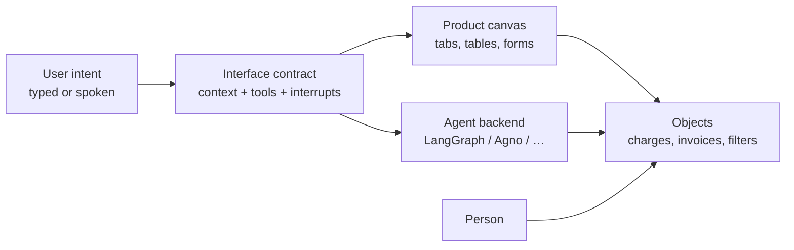
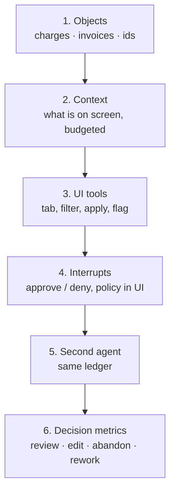
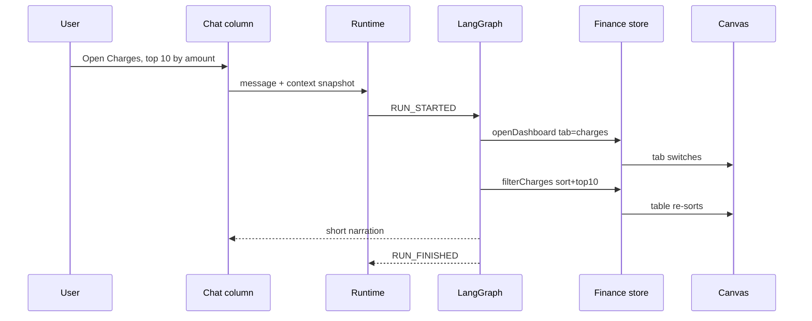
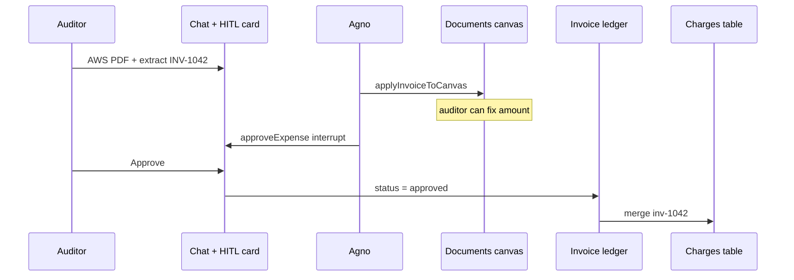
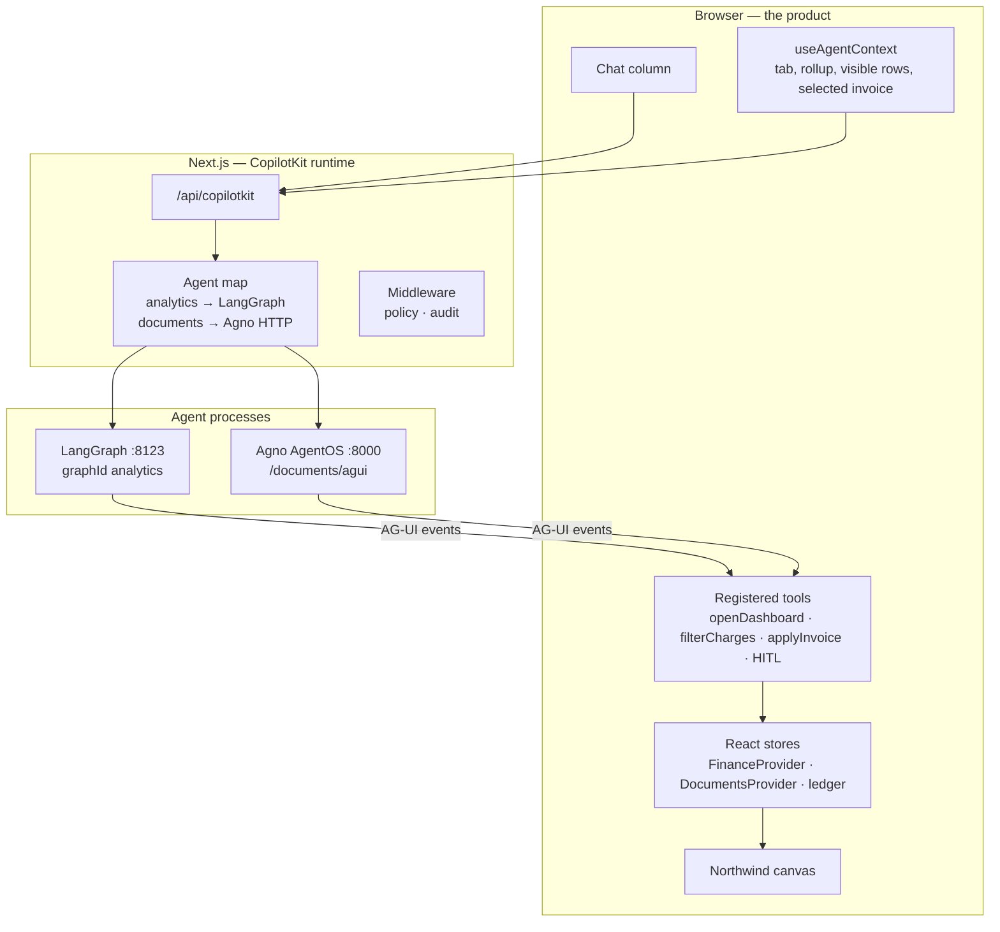

# Agentification is a product change, not a chat launch

*A techno-functional brief for product managers. What agentification actually is, how we sequenced the build, how the UI moves, and what we shipped under the hood.*

If your roadmap says “add an agent,” most teams hear “add a model and a sidebar.” That is a launch. It is not agentification.

Agentification is when a person and a model operate the same product objects — the same tab, the same invoice, the same charge — and the screen stays true while both of them move. Chat is one way to issue intent. It is not the feature.

This is the brief I would hand a PM who has to fund, spec, and demo that change. It is written from a working finance workspace, not a reference architecture. We put two agents behind one Northwind console: LangGraph on analytics, Agno on documents. They share a ledger. The React app publishes what is on screen, exposes tools that move the canvas, and pauses the run when money is involved.

---

## 1. What “agentification” means in a product org

Enterprise software already has users, objects, and writes. Agentification adds a third actor that can read those objects, propose writes, and wait.

That sounds abstract. In practice it is three capability levels. Most “copilot” programs stop at the first and call it done.

| Level | What the user experiences | What you have actually built | Example in our workspace |
| --- | --- | --- | --- |
| **1. Explain** | The model answers questions about the domain | A chat log next to the app | “What is Northwind spend policy?” |
| **2. Operate** | The model changes the screen the user is looking at | Frontend tools bound to real UI state | “Open Charges and show the top 10” — the tab switches, the table sorts |
| **3. Supervise writes** | The model prepares a consequential action; a person signs it | An interrupt that does not resolve itself | Approve the $91,800 AWS charge; approve an extracted invoice |

Level 1 is a help center with a better language model. Level 2 is where the product starts to feel different: the canvas moves without a click. Level 3 is where you are allowed near ERP, payments, or identity.

**Agentification is the move from 1 → 2 → 3 on a workflow that already has a canvas.** It is not a company-wide assistant. A company-wide assistant has no objects. It will look busy and change no system of record.

Three other words get used as if they were the same thing. They are not.

| Term | Owns | Does not own |
| --- | --- | --- |
| **Model** | Tokens in, tokens out | Your charges table |
| **Orchestration** (LangGraph, Agno, …) | Plans, tool selection, graph nodes | How a React tab updates |
| **Interface contract** (AG-UI + your tools) | How intent, state, and approval travel between agent and UI | Your spend policy |

PMs get pulled into model bake-offs because those are easy to schedule. The product work is the third row. If you skip it, engineering will still “ship an agent.” Users will still copy numbers out of the thread.

The objects sit in the middle. That is the whole model.

---

## 2. The workflow we chose, and why

We did not agentify “finance.” We agentify two jobs that already share a ledger.

**Job A — Analyze spend.** A controller is on a dashboard. They want the view to change: Charges tab, top 10 by amount, a chart of vendor mix, a flag on a row. The agent must *see* the current tab and *drive* the next one.

**Job B — Intake a document.** An auditor drops a PDF. Fields must land on a form next to the file, not in a paragraph. Over $500, someone has to approve. After approval, that row must appear in Job A’s charge list so it can be charted.

Those two jobs are how you test whether you built a product or a pair of demos. If the document agent and the analytics agent can only share a transcript, you will spend the next quarter writing glue. If they share `inv-1042` on a ledger, the handoff is a product write.

That is the selection rule I would put in a PRD: pick a workflow that already has a screen, at least one filter, and at least one write that legal will not let a model finish alone. Invoice audit, claims review, inventory exception, close checklist. Not “ask HR anything.”

---

## 3. How we sequenced the build

This is the order that held. It is also the order I would put on a two-quarter roadmap. We did not start with a platform team.

### Step 1 — Name the objects

Charges, cards, ledger rows, invoices. Statuses: extracted, approved, rejected. IDs the UI and both agents can point at (`c1`, `INV-1042`, later `inv-*` on the finance table). If you cannot draw the objects on a whiteboard without mentioning GPT, you are not ready for an agent.

### Step 2 — Publish live context

Every render, the canvas tells the agent what the user is looking at. Not a system prompt written in January. A structured snapshot: user, tab, charge rollup, first N visible rows, active filter, selected invoice, policy line.

This is the first product surface you will under-specify. Too little context and the model asks the user to retype the screen. Too much and you blow the token window on a demo you have already rehearsed. We ship a rollup plus 18 visible charges, not the full table. Context is budgeted, like a payload.

### Step 3 — Register UI movement as tools

This is the section most PRDs skip, and the one users actually notice. The agent does not “navigate.” It calls named tools that your app already knows how to run. Each tool is a product verb with a typed payload.

### Step 4 — Put policy on interrupts, not in the prompt

`approveCharge` and `approveExpense` do not return until a person clicks. Receipts over $500 require a reason. Over $10,000 cite spend policy. A system prompt is a suggestion. A blocked tool is a control.

### Step 5 — Add the second agent on the same objects

Documents arrive through Agno. Charts leave through LangGraph. The join is the ledger, not an agent-to-agent protocol. That is Quarter 2. If this fails, you have two chatbots.

### Step 6 — Measure supervision cost

Review time on the card, edit rate on extracted fields, abandoned approvals, rework into the ERP. Not messages sent.

Do not invert this. A platform, a memory layer, and a Slack channel on top of Level 1 will get internal press. They will not move a filter.

---

## 4. How the UI moves

This is the part to watch in a demo. A sentence in the chat column is not the output. The output is the canvas changing.

### Walkthrough A — “Open Charges and show the top 10”

What the user types is intent. What the product does is two tool calls.

1. The request hits the CopilotKit runtime and is routed to the LangGraph `analytics` agent.
2. The agent already has context: current tab, rollup, visible rows. It does not need the user to describe the dashboard.
3. It calls `openDashboard({ tab: "charges" })`. The handler is one line: `finance.setTab("charges")`. The right-hand canvas switches. No route change, no new page.
4. It calls `filterCharges({ sort: "most-expensive", show: "top10" })`. The handler writes the filter into the same React store. The table re-sorts and slices.
5. Text may stream into the chat column as narration. The proof is the table, not the sentence.

If you are writing acceptance criteria, they look like this:

- Given the user is on Overview, when they ask for the top 10 charges, the Charges tab is selected without a click.
- The table is sorted by amount descending and limited to 10 rows.
- The chat column may explain the view; it must not be the only place the answer appears.

That is UI movement. It is also why “the agent cannot see the work” and “the agent cannot change the work” are the same bug, seen from two sides.

### Walkthrough B — “I attached the AWS invoice”

Same contract, different backend, different verbs.

1. The Documents tab is active, so the runtime routes to Agno.
2. `extract_invoice` runs on the server (PDF → structured fields).
3. `applyInvoiceToCanvas` runs on the client. Vendor, amount, date, line items, confidence land on the Documents canvas. The tab switches if it has to. The auditor can edit a field *on the form*. That edit is the record.
4. `approveExpense` opens an Approve / Deny card in the chat column. The run pauses. Nothing is “approved” in prose.
5. On Approve, the invoice is written to the ledger. FinanceProvider merges approved rows into charges with an `inv-` prefix.
6. A later analytics turn can open Charges, summarize `inv-*`, and render a bar chart. The documents agent is not in that turn. The object is.

### The verb table (put this in the spec)

These are the product verbs we registered. A PM can read this as the interaction model. Engineering can read it as the tool list. They should be the same document.

| Verb | Who calls it | What moves on screen | Writes money? |
| --- | --- | --- | --- |
| `openDashboard` | analytics or documents | Switches Overview / Cards / Charges / Transactions / Reports / Documents | No |
| `filterCharges` | analytics | Search, status, sort, top-10 on the charges table | No |
| `flagTransaction` | analytics | Opens Transactions, flags a row, attaches a note | No |
| `addNoteToTransaction` | analytics | Note on a row | No |
| `demoControlledMetric` | analytics | KPI card in chat (your component, agent-supplied props) | No |
| `generate_a2ui` | analytics | Catalog `PieChart` / `BarChart` / `DataTable` on Reports | No |
| `generateSandboxedUi` | analytics | HTML/JS chart in a sandbox iframe | No |
| `draftEmail` | analytics | To / Subject / Body card with Copy — not a blob of markdown | No |
| `approveCharge` | analytics | Charges tab + Approve/Deny card; run waits | Yes |
| `applyInvoiceToCanvas` | documents | Documents tab fills with structured invoice fields | No |
| `approveExpense` | documents | Approve/Deny card; on approve, ledger → charges | Yes |

Two rules we wrote down and then had to keep repeating in tool descriptions, because models will otherwise “approve” in plain text:

1. **If the user asked to open, filter, or apply — call the tool. Do not describe the UI you wish you had changed.**
2. **If the user asked to approve — call the HITL tool. Never mark approved in a sentence.**

That is the PM-to-engineering contract for UI movement. Design the verbs. Name them. Refuse narration as a substitute.

### Three ways the screen can grow a new control

Not every new rectangle is the same risk.

| Pattern | What the agent is allowed to do | What the user sees | Use when |
| --- | --- | --- | --- |
| **Static** | Pick a component you already shipped and fill props | A KPI card, an email draft, an approval that looks like the rest of the app | Default. Production. Money-adjacent UI. |
| **Declarative (A2UI)** | Return a layout description (`PieChart` + `DataTable`) from a catalog you own | A branded chart on Reports, no model-written code | The business wants another cut of the same data every week |
| **Open (sandbox)** | Write HTML/JS that runs in an iframe | A one-off doughnut, exploratory viz | Catalog gap or a demo. Never for a write. |

We shipped all three in one presenter flow so a stakeholder can feel the difference. The recommendation in a PRD is still: live in static for a year, add A2UI when you are tired of forking chart files, keep the sandbox off the payment path.

---

## 5. How we built it technically

PMs do not need the repo. They do need to know which layer they are buying, which layer they are staffing, and which layer they must not let a vendor own.

### Three processes, one contract

| Layer | What it is | Who owns it | What a PM should ask |
| --- | --- | --- | --- |
| **Product state** | Charges, filters, invoice ledger, tab | Your team, always | What is the source of truth if chat and canvas disagree? |
| **Tool layer** | Named verbs + HITL renderers | Your team, on your design system | Which verbs move UI vs write money? |
| **Runtime** | Routing, auth, AG-UI stream, A2UI injection | CopilotKit in our case | What happens if we swap LangGraph for something else? |
| **Agent backends** | Plans and tool selection | Can differ per job | Can two backends share objects without a transcript relay? |

The React tree does not know which Python stack produced the next event. That is the test of the contract. We used two backends on purpose so the UI could not cheat.

AG-UI is the event language on the wire: lifecycle (`RUN_STARTED` / `RUN_FINISHED` / `RUN_ERROR`), streamed text, streamed tool calls (arguments arrive in pieces — your chart must not crash on half-JSON), and state (`STATE_SNAPSHOT`, `STATE_DELTA` as JSON Patch). CopilotKit is the production frontend implementation: `useAgentContext`, `useFrontendTool`, `useHumanInTheLoop`, chat, runtime.

What we still own if we adopt all of that: the objects, the policy, the components, the eval. Nobody productizes your domain.

### Why UI movement is a frontend tool, not a navigation API

`openDashboard` is not a link. It is a function registered into the agent’s tool list, with a Zod schema the model can fill, and a handler that writes React state. The model is not “controlling the DOM.” It is calling the same setters a click would call.

That distinction matters in a security review. You are not giving the model a browser. You are giving it the verbs you would have put on a toolbar, plus the ones you would never put on a toolbar without a confirm (`approveCharge`).

### What the presenter flow is for

The 12-step Demo panel is not the product. It is the acceptance script.

| Steps | Capability you are proving | What to watch |
| --- | --- | --- |
| 1 | Context | Model describes the live tab without being told |
| 2 | UI movement | Charges opens, top 10 applies |
| 3 | Static gen-UI | Your KPI card, agent props |
| 4–5 | A2UI | Catalog pie / bar on Reports |
| 6 | Sandbox | Disposable doughnut |
| 7 | HITL on analytics | Approve card on charge `c1` |
| 8–10 | Second agent + HITL | PDF → canvas → Approve; budget ~30s each |
| 11 | Shared objects | `inv-*` rows charted by analytics |
| 12 | Observability | Live AG-UI event stream on Reports |

Dry-run flips tabs and filters without calling a model. Use it in CI. For a live room: smoke HTTP, hard-refresh `/chat`, run steps 1–2 against the real graph. If LangGraph or the key is wrong, you want to know before anyone talks about vision.

---

## 6. What to put in the PRD

Copy this. Delete what does not apply. Do not replace it with “integrate an LLM.”

**Problem.** Reviewers retype what is already on screen, and sign-off happens in email.

**User.** Named role (controller, auditor), named objects, named write.

**Non-goals.** Company-wide chat. Model-written production HTML. Auto-approve over a policy threshold.

**Interaction model.** The verb table in §4. Each verb has: trigger (user language), payload, canvas effect, whether the run pauses.

**Context budget.** Fields in the snapshot, max rows, what is rolled up. Treat this like an API response size.

**Conflict rule.** If the user edits a field while the model is still reasoning, the user’s edit wins until an explicit later action.

**Failure states.** Agent waiting on the user (first-class, not an error). Tool called with partial args (component still renders). Backend down (canvas still usable by hand).

**Acceptance.** Walkthroughs A and B. A third: canvas still works with the chat column closed.

**Metrics.** Review time, edit rate, abandon, rework. Plus the boring ones: wrong extract, double-pay, missed interrupt.

**Staffing.** One PM on the objects, one designer on the interrupt, two engineers who have shipped streaming UI, one owner of the system of record. The model vendor is a dependency.

---

## 7. How I would go ahead from here

**This quarter.** One workflow, Level 2 plus one Level 3 interrupt, on the existing design system. Ship context + three UI verbs + one approval. Measure review time. Do not open a platform workstream.

**Next quarter.** A second agent on the same objects. If the join requires a message bus between agents, you sequenced wrong — go back to the ledger.

**Do not fund yet.** A sidebar memory feature, a company assistant, a model bake-off with no verb table, open generative UI on a write path.

**Done looks like this.** A reviewer corrects a total on the canvas. The agent continues from that total. Approve writes a row the next agent can chart. Nobody pasted a number into a prompt.

---

## 8. The test I would run in a design review

Sit the person who owns the real job in front of the prototype. Give them one sentence from Walkthrough A and one PDF from Walkthrough B.

If they talk to the panel and then turn back to the canvas to do the work, you are still at Level 1.

If the canvas moves, and they only look at chat when the product asks them to sign, you have started agentification.

That is the whole distinction. The model stack will change. The objects, the verbs, and the interrupt will not. Spec those, and the build is ordinary product engineering — which is what this was.

---

*From AG-UI Studio: a CopilotKit example that runs LangGraph (`analytics`) and Agno (`documents`) against one Northwind workspace. Protocol: [AG-UI](https://ag-ui.com). Frontend implementation: CopilotKit (`useAgentContext`, `useFrontendTool`, `useHumanInTheLoop`).*
